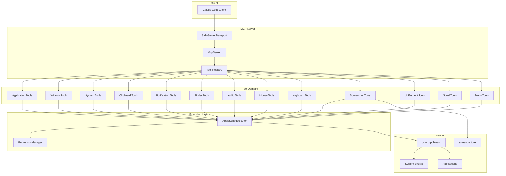
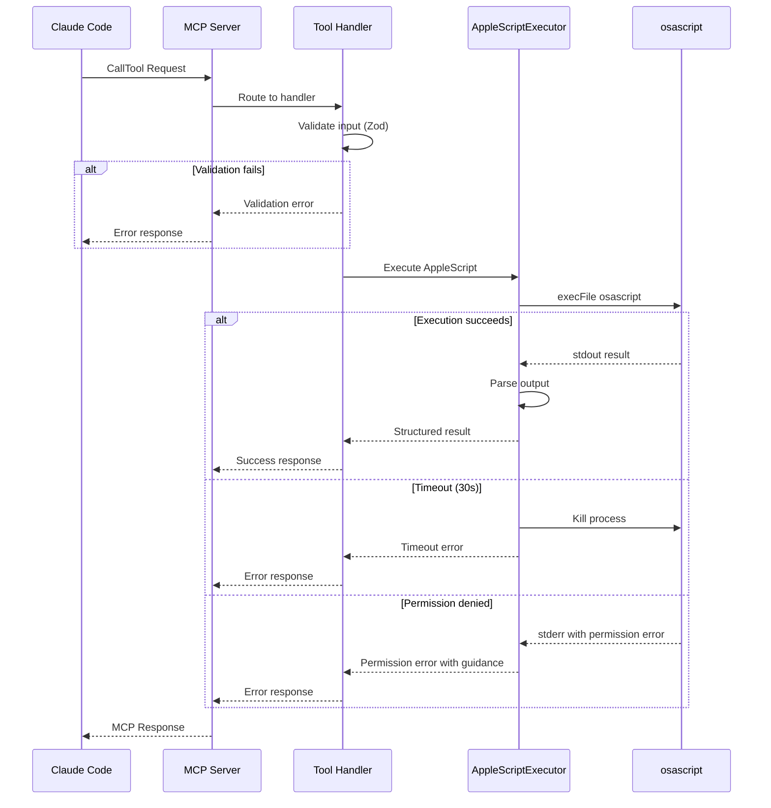
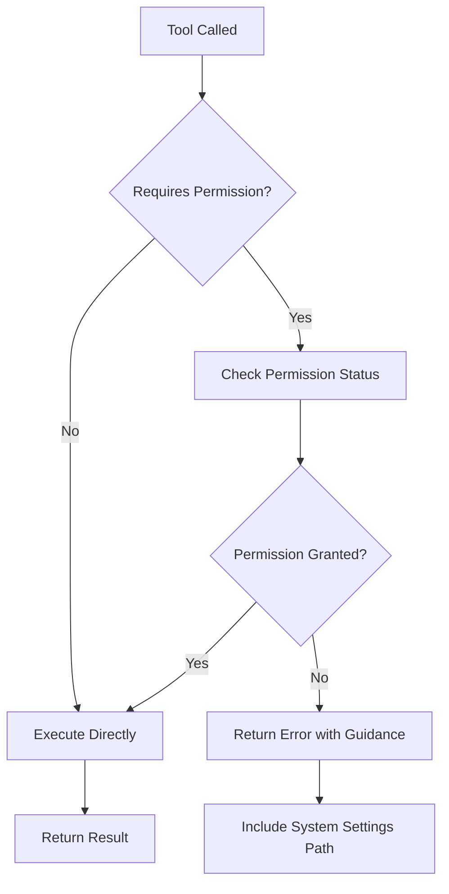

# Design Document: macOS AppleScript MCP Server

## Overview

**Purpose**: This MCP server delivers comprehensive macOS automation capabilities to AI assistants, enabling control of applications, windows, system functions, and UI elements through a standardized protocol.

**Users**: AI assistants (Claude, via Claude Code) utilize this for desktop automation workflows including application management, window organization, file operations, and accessibility-based UI interaction.

**Impact**: Introduces a new MCP server that bridges AI assistants with macOS system capabilities through AppleScript execution.

### Goals
- Provide 45+ tools covering application, window, system, clipboard, notification, Finder, audio, mouse, keyboard, screenshot, UI element, scroll, and menu operations
- Execute AppleScript safely with timeout protection and structured error responses
- Handle macOS permissions gracefully with user-friendly guidance
- Maintain strict type safety with Zod schemas for all tool inputs

### Non-Goals
- Native addon implementation (AppleScript approach preferred for simplicity)
- Cross-platform support (macOS-only by design)
- Real-time event streaming (request/response model only)
- Persistent state management (stateless tool execution)

## Architecture

> See `research.md` for detailed investigation notes on MCP SDK, AppleScript execution, and macOS APIs.

### Architecture Pattern & Boundary Map

**Selected pattern**: Modular Tool-Based Architecture with Shared Execution Engine



**Architecture Integration**:
- **Selected pattern**: Modular tool-based with shared execution engine for AppleScript
- **Domain boundaries**: Tools grouped by functional domain (13 domains, ~45 tools); each domain is independently testable
- **Existing patterns preserved**: MCP SDK patterns for tool registration and response format
- **New components rationale**: AppleScriptExecutor centralizes osascript invocation with timeout/error handling; PermissionManager detects and reports permission issues

### Technology Stack

| Layer | Choice / Version | Role in Feature | Notes |
|-------|------------------|-----------------|-------|
| Runtime | Node.js >= 18.x | JavaScript execution environment | Required for ES modules and modern APIs |
| Language | TypeScript 5.x | Type-safe development | Strict mode enabled |
| MCP SDK | @modelcontextprotocol/sdk 1.x | Protocol implementation | StdioServerTransport for Claude Code |
| Validation | Zod 3.x | Input schema validation | Integrated with MCP SDK |
| Execution | child_process (native) | osascript invocation | execFile for security |
| Build | tsup or esbuild | Bundle TypeScript | Single executable output |

## System Flows

### Tool Execution Flow



### Permission Check Flow



## Requirements Traceability

| Requirement | Summary | Components | Interfaces | Flows |
|-------------|---------|------------|------------|-------|
| 1.1-1.5 | MCP Server Core | McpServer, StdioServerTransport | ServerConfig, ToolDefinition | Tool Execution |
| 2.1-2.5 | AppleScript Engine | AppleScriptExecutor | ExecuteOptions, ExecuteResult | Tool Execution |
| 3.1-3.5 | Application Control | ApplicationTools | AppInfo, LaunchOptions | Tool Execution |
| 4.1-4.6 | Window Management | WindowTools | WindowInfo, WindowPosition | Tool Execution |
| 5.1-5.4 | System Information | SystemTools | SystemInfo, BatteryStatus | Tool Execution |
| 6.1-6.4 | Clipboard Operations | ClipboardTools | ClipboardContent | Tool Execution |
| 7.1-7.4 | Notifications | NotificationTools | NotificationOptions | Tool Execution |
| 8.1-8.4 | Finder Integration | FinderTools | FileInfo, FinderPath | Tool Execution |
| 9.1-9.6 | Audio Control | AudioTools | VolumeLevel, MuteStatus | Tool Execution |
| 10.1-10.5 | Error Handling | AppleScriptExecutor, All Tools | ErrorResponse | Tool Execution |
| 11.1-11.7 | Security/Permissions | PermissionManager | PermissionStatus | Permission Check |
| 12.1-12.8 | Mouse Control | MouseTools | ClickOptions, DragOptions | Tool Execution |
| 13.1-13.8 | Keyboard Input | KeyboardTools | KeystrokeOptions | Tool Execution |
| 14.1-14.8 | Screenshots | ScreenshotTools | ScreenshotOptions | Tool Execution |
| 15.1-15.7 | UI Elements | UIElementTools | UIElementTree, ElementAction | Tool Execution |
| 16.1-16.6 | Scroll/Navigation | ScrollTools | ScrollOptions | Tool Execution |
| 17.1-17.11 | Menu Bar/Status | MenuTools | MenuHierarchy, StatusItem | Tool Execution |

## Components and Interfaces

| Component | Domain/Layer | Intent | Req Coverage | Key Dependencies | Contracts |
|-----------|--------------|--------|--------------|------------------|-----------|
| McpServerInstance | Protocol | MCP server lifecycle | 1.1-1.5 | @modelcontextprotocol/sdk (P0) | Service |
| AppleScriptExecutor | Execution | Execute osascript with timeout | 2.1-2.5, 10.1-10.5 | child_process (P0), InputSanitizer (P0) | Service |
| PermissionManager | Security | Check/report permission status | 11.1-11.7 | AppleScriptExecutor (P0) | Service |
| InputSanitizer | Security | Sanitize inputs for AppleScript | 11.2, 11.4 | None | Service |
| ApplicationTools | Tools | App lifecycle management | 3.1-3.5 | AppleScriptExecutor (P0) | Service |
| WindowTools | Tools | Window manipulation | 4.1-4.6 | AppleScriptExecutor (P0) | Service |
| SystemTools | Tools | System info retrieval | 5.1-5.4 | AppleScriptExecutor (P0) | Service |
| ClipboardTools | Tools | Clipboard read/write | 6.1-6.4 | AppleScriptExecutor (P0) | Service |
| NotificationTools | Tools | macOS notifications | 7.1-7.4 | AppleScriptExecutor (P0) | Service |
| FinderTools | Tools | Finder operations | 8.1-8.4 | AppleScriptExecutor (P0) | Service |
| AudioTools | Tools | Volume/mute control | 9.1-9.6 | AppleScriptExecutor (P0) | Service |
| MouseTools | Tools | Mouse simulation | 12.1-12.8 | AppleScriptExecutor (P0) | Service |
| KeyboardTools | Tools | Keyboard simulation | 13.1-13.8 | AppleScriptExecutor (P0) | Service |
| ScreenshotTools | Tools | Screen capture | 14.1-14.8 | screencapture (P0) | Service |
| UIElementTools | Tools | Accessibility UI interaction | 15.1-15.7 | AppleScriptExecutor (P0), PermissionManager (P0) | Service |
| ScrollTools | Tools | Scroll operations | 16.1-16.6 | AppleScriptExecutor (P0) | Service |
| MenuTools | Tools | Menu bar/status items | 17.1-17.11 | AppleScriptExecutor (P0) | Service |

### Execution Layer

#### AppleScriptExecutor

| Field | Detail |
|-------|--------|
| Intent | Execute AppleScript commands via osascript with timeout management and output parsing |
| Requirements | 2.1, 2.2, 2.3, 2.4, 2.5, 10.1, 10.4 |

**Responsibilities & Constraints**
- Execute AppleScript via osascript binary using execFile (no shell)
- Enforce 30-second timeout and kill hung processes
- Capture stdout/stderr and parse structured output
- Never execute arbitrary shell commands

**Dependencies**
- Inbound: All tool modules — execute AppleScript (P0)
- External: Node.js child_process — process execution (P0)

**Contracts**: Service [x]

##### Service Interface
```typescript
interface ExecuteOptions {
  script: string;
  timeout?: number;  // Default: 30000ms
}

interface ExecuteResult {
  success: boolean;
  output?: string;
  parsed?: unknown;  // Parsed JSON if applicable
  error?: string;
}

interface AppleScriptExecutorService {
  execute(options: ExecuteOptions): Promise<ExecuteResult>;
  executeWithArgs(script: string, args: string[]): Promise<ExecuteResult>;
}
```
- Preconditions: script is non-empty string
- Postconditions: Returns result within timeout; process killed if timeout exceeded
- Invariants: Never executes shell commands; only osascript

**Implementation Notes**
- Integration: Use `execFile('osascript', ['-e', script])` for single-line or `-` for stdin
- Validation: Sanitize script for injection (no user-controlled shell escapes)
- Risks: Long-running scripts; mitigated by enforced timeout

---

#### PermissionManager

| Field | Detail |
|-------|--------|
| Intent | Check macOS permission status and generate user guidance |
| Requirements | 11.1, 11.5, 11.6, 11.7 |

**Responsibilities & Constraints**
- Check Accessibility permission via System Events
- Detect Automation permission errors per-app
- Detect Screen Recording permission for screenshots
- Generate actionable error messages with System Settings paths

**Dependencies**
- Inbound: Tools requiring permissions — check status (P0)
- Outbound: AppleScriptExecutor — execute check scripts (P0)

**Contracts**: Service [x]

##### Service Interface
```typescript
type PermissionType = 'accessibility' | 'automation' | 'screenRecording';

interface PermissionStatus {
  granted: boolean;
  type: PermissionType;
  guidance?: string;  // How to grant permission
}

interface PermissionManagerService {
  checkAccessibility(): Promise<PermissionStatus>;
  checkAutomation(appName: string): Promise<PermissionStatus>;
  checkScreenRecording(): Promise<PermissionStatus>;
  getPermissionGuidance(type: PermissionType): string;
}
```
- Preconditions: None
- Postconditions: Returns accurate status based on current system state
- Invariants: Never modifies system permissions

**Implementation Notes**
- Integration: Accessibility check via `tell application "System Events" to UI elements enabled`
- Validation: Cache permission status for performance (invalidate on error)
- Risks: Permission status may change during execution; handle dynamically

---

#### InputSanitizer

| Field | Detail |
|-------|--------|
| Intent | Sanitize user inputs before AppleScript interpolation to prevent injection |
| Requirements | 11.2, 11.4 |

**Responsibilities & Constraints**
- Escape AppleScript string literals to prevent breaking out of string context
- Validate file paths against traversal and null byte attacks
- Sanitize identifiers (app names, window titles) for safe interpolation
- Never modify semantic meaning of input, only escape special characters

**Dependencies**
- Inbound: All tool modules — sanitize inputs before script building (P0)
- External: None (pure function implementation)

**Contracts**: Service [x]

##### Service Interface
```typescript
interface InputSanitizerService {
  /**
   * Escape string for safe interpolation in AppleScript string literals.
   * Escapes: backslash (\) and double quote (")
   * @example sanitizeString('Say "Hello"') → 'Say \\"Hello\\"'
   */
  sanitizeString(input: string): string;

  /**
   * Validate and sanitize file system paths.
   * Rejects: null bytes, empty paths
   * Normalizes: removes redundant separators
   * @throws Error if path contains invalid characters
   */
  sanitizePath(path: string): string;

  /**
   * Sanitize application/process identifiers.
   * Applies string sanitization + length validation
   * @throws Error if identifier exceeds reasonable length (255 chars)
   */
  sanitizeIdentifier(identifier: string): string;
}
```
- Preconditions: Input is non-null string
- Postconditions: Output is safe for AppleScript interpolation
- Invariants: Never alters semantic meaning; only escapes special characters

**Implementation Notes**
- Integration: Called by all tool handlers before building AppleScript commands
- Escaping rules:
  ```typescript
  // AppleScript string escaping
  sanitizeString(input: string): string {
    return input
      .replace(/\\/g, '\\\\')  // Escape backslashes first
      .replace(/"/g, '\\"');    // Escape double quotes
  }
  ```
- Path validation: Reject paths containing `\0` (null byte)
- Usage pattern in tools:
  ```typescript
  // Safe: user input is escaped
  const script = `tell application "${sanitizer.sanitizeIdentifier(appName)}" to activate`;
  ```
- Risks: None when used correctly; all user inputs MUST pass through sanitizer

---

### Tool Domains

#### ApplicationTools

| Field | Detail |
|-------|--------|
| Intent | Manage macOS application lifecycle (list, launch, quit, activate) |
| Requirements | 3.1, 3.2, 3.3, 3.4, 3.5 |

**Contracts**: Service [x]

##### Service Interface
```typescript
// Tool: list_running_apps
const ListRunningAppsSchema = z.object({});
interface RunningApp {
  name: string;
  bundleId: string;
  processId: number;
}

// Tool: launch_app
const LaunchAppSchema = z.object({
  name: z.string().describe('Application name to launch'),
});

// Tool: quit_app
const QuitAppSchema = z.object({
  name: z.string().describe('Application name to quit'),
});

// Tool: activate_app
const ActivateAppSchema = z.object({
  name: z.string().describe('Application name to bring to foreground'),
});
```

**Implementation Notes**
- Integration: AppleScript `tell application "System Events" to get name of every process`
- Validation: App name validated; error returned if not found
- Risks: App may refuse to quit; use graceful quit with timeout

---

#### WindowTools

| Field | Detail |
|-------|--------|
| Intent | Control window positions, sizes, and focus state |
| Requirements | 4.1, 4.2, 4.3, 4.4, 4.5, 4.6 |

**Contracts**: Service [x]

##### Service Interface
```typescript
// Tool: list_windows
const ListWindowsSchema = z.object({
  appName: z.string().optional().describe('Filter by application name'),
});
interface WindowInfo {
  title: string;
  appName: string;
  position: { x: number; y: number };
  size: { width: number; height: number };
  id: number;
}

// Tool: focus_window
const FocusWindowSchema = z.object({
  windowId: z.number().describe('Window identifier'),
});

// Tool: move_window
const MoveWindowSchema = z.object({
  windowId: z.number().describe('Window identifier'),
  x: z.number().describe('X coordinate'),
  y: z.number().describe('Y coordinate'),
});

// Tool: resize_window
const ResizeWindowSchema = z.object({
  windowId: z.number().describe('Window identifier'),
  width: z.number().describe('New width'),
  height: z.number().describe('New height'),
});

// Tool: minimize_window
const MinimizeWindowSchema = z.object({
  windowId: z.number().describe('Window identifier'),
});
```

**Implementation Notes**
- Integration: AppleScript System Events `bounds of window 1`
- Validation: Window ID validated; error if window not found
- Risks: Some apps have non-standard window handling

---

#### SystemTools

| Field | Detail |
|-------|--------|
| Intent | Retrieve system hardware and software information |
| Requirements | 5.1, 5.2, 5.3, 5.4 |

**Contracts**: Service [x]

##### Service Interface
```typescript
// Tool: get_system_info
const GetSystemInfoSchema = z.object({});
interface SystemInfo {
  macOSVersion: string;
  hardwareModel: string;
  processorInfo: string;
  totalMemory: string;
}

// Tool: get_battery_status
const GetBatteryStatusSchema = z.object({});
interface BatteryStatus {
  percentage: number;
  isCharging: boolean;
  isDesktop: boolean;  // true if no battery
}

// Tool: get_display_info
const GetDisplayInfoSchema = z.object({});
interface DisplayInfo {
  name: string;
  resolution: { width: number; height: number };
  isMain: boolean;
}
```

**Implementation Notes**
- Integration: AppleScript `do shell script "system_profiler SPHardwareDataType"`
- Validation: None required; system info always available
- Risks: None significant

---

#### ClipboardTools

| Field | Detail |
|-------|--------|
| Intent | Read and write system clipboard content |
| Requirements | 6.1, 6.2, 6.3, 6.4 |

**Contracts**: Service [x]

##### Service Interface
```typescript
// Tool: get_clipboard
const GetClipboardSchema = z.object({});
interface ClipboardContent {
  text?: string;
  contentType: 'text' | 'image' | 'files' | 'other';
}

// Tool: set_clipboard
const SetClipboardSchema = z.object({
  text: z.string().describe('Text content to set'),
});
```

**Implementation Notes**
- Integration: AppleScript `the clipboard as text` and `set the clipboard to`
- Validation: Text content only for set; detect type for get
- Risks: Large clipboard content; consider size limits

---

#### NotificationTools

| Field | Detail |
|-------|--------|
| Intent | Display macOS system notifications |
| Requirements | 7.1, 7.2, 7.3, 7.4 |

**Contracts**: Service [x]

##### Service Interface
```typescript
// Tool: send_notification
const SendNotificationSchema = z.object({
  title: z.string().describe('Notification title'),
  message: z.string().describe('Notification body'),
  subtitle: z.string().optional().describe('Optional subtitle'),
  sound: z.boolean().optional().describe('Play notification sound'),
});
```

**Implementation Notes**
- Integration: AppleScript `display notification "message" with title "title"`
- Validation: Title and message required
- Risks: Notifications may be silenced by user preferences

---

#### FinderTools

| Field | Detail |
|-------|--------|
| Intent | Interact with Finder for file operations |
| Requirements | 8.1, 8.2, 8.3, 8.4 |

**Contracts**: Service [x]

##### Service Interface
```typescript
// Tool: reveal_in_finder
const RevealInFinderSchema = z.object({
  path: z.string().describe('File or folder path to reveal'),
});

// Tool: get_selected_files
const GetSelectedFilesSchema = z.object({});

// Tool: get_finder_window_path
const GetFinderWindowPathSchema = z.object({});
```

**Implementation Notes**
- Integration: AppleScript `tell application "Finder" to reveal POSIX file`
- Validation: Path existence checked; error if not found
- Risks: Path may not exist

---

#### AudioTools

| Field | Detail |
|-------|--------|
| Intent | Control system audio volume and mute state |
| Requirements | 9.1, 9.2, 9.3, 9.4, 9.5, 9.6 |

**Contracts**: Service [x]

##### Service Interface
```typescript
// Tool: get_volume
const GetVolumeSchema = z.object({});

// Tool: set_volume
const SetVolumeSchema = z.object({
  value: z.number().min(0).max(100).describe('Volume percentage (0-100)'),
});

// Tool: get_mute_status
const GetMuteStatusSchema = z.object({});

// Tool: set_mute
const SetMuteSchema = z.object({
  muted: z.boolean().describe('Mute state'),
});
```

**Implementation Notes**
- Integration: AppleScript `output volume of (get volume settings)`
- Validation: Volume range 0-100 enforced by Zod
- Risks: None significant

---

#### MouseTools

| Field | Detail |
|-------|--------|
| Intent | Simulate mouse movements and clicks |
| Requirements | 12.1, 12.2, 12.3, 12.4, 12.5, 12.6, 12.7, 12.8 |

**Contracts**: Service [x]

##### Service Interface
```typescript
type MouseButton = 'left' | 'right' | 'middle';
type ModifierKey = 'command' | 'shift' | 'option' | 'control';

// Tool: click
const ClickSchema = z.object({
  x: z.number().describe('X coordinate'),
  y: z.number().describe('Y coordinate'),
  button: z.enum(['left', 'right', 'middle']).optional().default('left'),
  modifiers: z.array(z.enum(['command', 'shift', 'option', 'control'])).optional(),
});

// Tool: double_click
const DoubleClickSchema = z.object({
  x: z.number().describe('X coordinate'),
  y: z.number().describe('Y coordinate'),
});

// Tool: move_mouse
const MoveMouseSchema = z.object({
  x: z.number().describe('X coordinate'),
  y: z.number().describe('Y coordinate'),
});

// Tool: drag
const DragSchema = z.object({
  startX: z.number().describe('Start X coordinate'),
  startY: z.number().describe('Start Y coordinate'),
  endX: z.number().describe('End X coordinate'),
  endY: z.number().describe('End Y coordinate'),
});
```

**Implementation Notes**
- Integration: AppleScript System Events `click at {x, y}`
- Validation: Coordinates validated as numbers
- Risks: Requires Accessibility permission; provide guidance if denied

---

#### KeyboardTools

| Field | Detail |
|-------|--------|
| Intent | Simulate keyboard input and key combinations |
| Requirements | 13.1, 13.2, 13.3, 13.4, 13.5, 13.6, 13.7, 13.8 |

**Contracts**: Service [x]

##### Service Interface
```typescript
// Tool: type_text
const TypeTextSchema = z.object({
  text: z.string().describe('Text to type'),
  delay: z.number().optional().describe('Delay between keystrokes in ms'),
});

// Tool: press_key
const PressKeySchema = z.object({
  key: z.string().describe('Key name (e.g., "enter", "escape", "tab", "f1")'),
  repeat: z.number().optional().default(1).describe('Number of times to press'),
});

// Tool: key_combination
const KeyCombinationSchema = z.object({
  modifiers: z.array(z.enum(['command', 'shift', 'option', 'control'])),
  key: z.string().describe('Key to press with modifiers'),
});
```

**Implementation Notes**
- Integration: AppleScript `keystroke "text"` and `key code X using {modifiers}`
- Validation: Key names mapped to key codes
- Risks: Requires Accessibility permission; target app must be focused

---

#### ScreenshotTools

| Field | Detail |
|-------|--------|
| Intent | Capture screen, window, or region screenshots |
| Requirements | 14.1, 14.2, 14.3, 14.4, 14.5, 14.6, 14.7, 14.8 |

**Contracts**: Service [x]

##### Service Interface
```typescript
// Tool: take_screenshot
const TakeScreenshotSchema = z.object({
  display: z.number().optional().describe('Display number (1-based)'),
  windowId: z.number().optional().describe('Window ID to capture'),
  region: z.object({
    x: z.number(),
    y: z.number(),
    width: z.number(),
    height: z.number(),
  }).optional().describe('Region to capture'),
  format: z.enum(['png', 'jpg']).optional().default('png'),
  filePath: z.string().optional().describe('Save to file instead of base64'),
});

interface ScreenshotResult {
  base64?: string;
  filePath?: string;
  format: 'png' | 'jpg';
  width: number;
  height: number;
}
```

**Implementation Notes**
- Integration: `screencapture -x -t png` piped to base64
- Validation: Window ID checked if provided
- Risks: Screen Recording permission required for window content

---

#### UIElementTools

| Field | Detail |
|-------|--------|
| Intent | Interact with UI elements via Accessibility APIs |
| Requirements | 15.1, 15.2, 15.3, 15.4, 15.5, 15.6, 15.7 |

**Contracts**: Service [x]

##### Service Interface
```typescript
// Tool: get_ui_elements
const GetUIElementsSchema = z.object({
  appName: z.string().describe('Application name'),
  maxDepth: z.number().optional().default(3).describe('Tree traversal depth'),
});
interface UIElement {
  role: string;
  title?: string;
  value?: string;
  position: { x: number; y: number };
  size: { width: number; height: number };
  children?: UIElement[];
  path: string;  // Unique identifier path
}

// Tool: click_ui_element
const ClickUIElementSchema = z.object({
  appName: z.string().describe('Application name'),
  elementPath: z.string().describe('Element path from get_ui_elements'),
});

// Tool: get_ui_element_value
const GetUIElementValueSchema = z.object({
  appName: z.string().describe('Application name'),
  elementPath: z.string().describe('Element path'),
});

// Tool: set_ui_element_value
const SetUIElementValueSchema = z.object({
  appName: z.string().describe('Application name'),
  elementPath: z.string().describe('Element path'),
  value: z.string().describe('Value to set'),
});

// Tool: focus_ui_element
const FocusUIElementSchema = z.object({
  appName: z.string().describe('Application name'),
  elementPath: z.string().describe('Element path'),
});
```

**Implementation Notes**
- Integration: AppleScript System Events UI scripting with `entire contents`
- Validation: Element path validated; error if not found
- Risks: Requires Accessibility permission; UI hierarchy may change

---

#### ScrollTools

| Field | Detail |
|-------|--------|
| Intent | Perform scroll operations in applications |
| Requirements | 16.1, 16.2, 16.3, 16.4, 16.5, 16.6 |

**Contracts**: Service [x]

##### Service Interface
```typescript
// Tool: scroll
const ScrollSchema = z.object({
  direction: z.enum(['up', 'down', 'left', 'right']),
  amount: z.number().optional().default(100).describe('Scroll amount in pixels'),
  x: z.number().optional().describe('X position to scroll at'),
  y: z.number().optional().describe('Y position to scroll at'),
});

// Tool: scroll_to_element
const ScrollToElementSchema = z.object({
  appName: z.string().describe('Application name'),
  elementPath: z.string().describe('Element path to scroll into view'),
});
```

**Implementation Notes**
- Integration: AppleScript scroll events or mouse wheel simulation
- Validation: Direction and amount validated
- Risks: Some areas may not support scrolling

---

#### MenuTools

| Field | Detail |
|-------|--------|
| Intent | Interact with application menus and status bar items |
| Requirements | 17.1, 17.2, 17.3, 17.4, 17.5, 17.6, 17.7, 17.8, 17.9, 17.10, 17.11 |

**Contracts**: Service [x]

##### Service Interface
```typescript
// Tool: list_menu_items
const ListMenuItemsSchema = z.object({
  appName: z.string().describe('Application name'),
});
interface MenuItem {
  name: string;
  shortcut?: string;
  enabled: boolean;
  checked: boolean;
  hasSubmenu: boolean;
  children?: MenuItem[];
}

// Tool: click_menu_item
const ClickMenuItemSchema = z.object({
  appName: z.string().describe('Application name'),
  menuPath: z.string().describe('Menu path (e.g., "File > Save As...")'),
});

// Tool: get_menu_item_state
const GetMenuItemStateSchema = z.object({
  appName: z.string().describe('Application name'),
  menuPath: z.string().describe('Menu path'),
});

// Tool: list_status_bar_items
const ListStatusBarItemsSchema = z.object({});
interface StatusBarItem {
  description: string;
  position: number;
  processName: string;
}

// Tool: click_status_bar_item
const ClickStatusBarItemSchema = z.object({
  identifier: z.string().describe('Description or process name'),
});

// Tool: click_status_bar_menu_item
const ClickStatusBarMenuItemSchema = z.object({
  identifier: z.string().describe('Status item identifier'),
  menuPath: z.string().describe('Menu item path'),
});

// Tool: get_menu_bar_structure
const GetMenuBarStructureSchema = z.object({
  processName: z.string().describe('Process name'),
});
```

**Implementation Notes**
- Integration: AppleScript `click menu item "X" of menu "Y" of menu bar 1`
- Validation: Menu path parsed and validated
- Risks: Menu items may be lazy-loaded; wait for population

## Tool Result Types Mapping

This section specifies the concrete return types for each tool, replacing the generic `unknown` with specific interfaces.

### Structured Data Tools

| Tool | Return Type | Parsing Strategy |
|------|-------------|------------------|
| list_running_apps | `RunningApp[]` | JSON parse from AppleScript record output |
| list_windows | `WindowInfo[]` | JSON parse from System Events properties |
| get_system_info | `SystemInfo` | Regex extraction from system_profiler output |
| get_battery_status | `BatteryStatus` | JSON parse from pmset output |
| get_display_info | `DisplayInfo[]` | JSON parse from System Events display properties |
| get_ui_elements | `UIElement` (tree) | Recursive JSON build from accessibility tree |
| list_menu_items | `MenuItem[]` | Recursive JSON build from menu hierarchy |
| list_status_bar_items | `StatusBarItem[]` | JSON parse from menu bar extras |
| get_menu_bar_structure | `MenuHierarchy` | Recursive JSON build with lazy-load handling |
| take_screenshot | `ScreenshotResult` | Direct construction (base64 + metadata) |

### Simple Value Tools

| Tool | Return Type | Parsing Strategy |
|------|-------------|------------------|
| get_volume | `number` (0-100) | Direct number parse from AppleScript |
| get_mute_status | `boolean` | Direct boolean parse |
| get_clipboard | `ClipboardContent` | String extraction with type detection |
| get_finder_window_path | `string` | Direct POSIX path extraction |
| get_selected_files | `string[]` | Split POSIX paths from list |
| get_menu_item_state | `MenuItemState` | Property extraction (enabled, checked) |

### Action Result Tools

| Tool | Return Type | Parsing Strategy |
|------|-------------|------------------|
| launch_app, quit_app, activate_app | `ActionResult` | Success confirmation or error |
| click, double_click, move_mouse, drag | `ActionResult` | Success confirmation |
| type_text, press_key, key_combination | `ActionResult` | Success confirmation |
| scroll, scroll_to_element | `ActionResult` | Success confirmation or scroll-not-available error |
| click_ui_element, set_ui_element_value | `ActionResult` | Success confirmation or element-not-found error |
| click_menu_item, click_status_bar_item | `ActionResult` | Success confirmation or path-invalid error |
| send_notification | `ActionResult` | Delivery confirmation |
| set_clipboard, set_volume, set_mute | `ActionResult` | Success confirmation |
| move_window, resize_window, minimize_window, focus_window | `ActionResult` | Success confirmation |
| reveal_in_finder | `ActionResult` | Success confirmation or path-not-found error |

### Result Type Definitions

```typescript
// Common action result for tools that perform operations
interface ActionResult {
  success: boolean;
  message?: string;  // Human-readable confirmation or error detail
}

// Menu item state for get_menu_item_state
interface MenuItemState {
  enabled: boolean;
  checked: boolean;
  hasSubmenu: boolean;
}

// Menu hierarchy for get_menu_bar_structure
interface MenuHierarchy {
  menus: MenuItem[];
  processName: string;
}
```

### Parsing Implementation Notes

1. **JSON from AppleScript**: Many tools generate JSON-formatted output using AppleScript's record/list literals, then parse with `JSON.parse()`

2. **Regex Extraction**: System info tools parse human-readable output (e.g., `system_profiler`) using regex patterns

3. **Recursive Tree Building**: UI element and menu tools traverse hierarchies depth-first, building typed tree structures

4. **Error Propagation**: Parse failures are caught and returned as error responses with diagnostic messages

---

## Data Models

### Domain Model

**AppleScript Execution Context**
- ExecuteOptions: Script content, timeout duration
- ExecuteResult: Success/failure, output text, parsed data, error message

**Tool Response Format**
- All tools return MCP-compliant responses:
  - Success: `{ content: [{ type: 'text', text: JSON.stringify(result) }] }`
  - Error: `{ isError: true, content: [{ type: 'text', text: errorMessage }] }`

### Logical Data Model

**Key Code Mapping**
- Map human-readable key names to macOS virtual key codes
- Support special keys: enter (36), escape (53), tab (48), delete (51), etc.
- Support function keys: f1-f12 (122-111)

## Error Handling

### Error Strategy
Fail fast with actionable guidance. All errors return structured responses enabling the AI to understand and potentially retry or inform the user.

### Error Categories and Responses

**Validation Errors (Input)**
- Missing required parameters → List missing fields
- Invalid types → Expected vs received type
- Out of range → Valid range description

**AppleScript Errors (Execution)**
- Script syntax error → Include AppleScript error message
- Timeout exceeded → Indicate 30s limit reached
- Application error → Include app-specific error

**Permission Errors (Security)**
- Accessibility denied → Guide to System Settings > Privacy > Accessibility
- Automation denied → Guide to System Settings > Privacy > Automation > [App Name]
- Screen Recording denied → Guide to System Settings > Privacy > Screen Recording

**Not Found Errors (Resources)**
- Application not found → Include searched name
- Window not found → Include window identifier
- UI element not found → Include element path
- Menu item not found → List available items at failed level

### Error Response Format
```typescript
interface ErrorResponse {
  isError: true;
  content: [{
    type: 'text';
    text: string;  // User-friendly error message with guidance
  }];
}
```

## Testing Strategy

### Unit Tests
- AppleScriptExecutor: Output parsing, timeout handling, error detection
- Zod schema validation: All tool input schemas
- Key code mapping: Special key name to code conversion
- Permission guidance: Error message generation

### Integration Tests
- Tool execution with real osascript (macOS only)
- Permission detection accuracy
- Screenshot capture pipeline

### E2E Tests (Manual)
- Full tool workflow with Claude Code
- Permission grant/deny flows
- Multi-tool sequences (e.g., launch app → focus window → click button)

### Limitations
- CI environment cannot run macOS-specific tests
- Integration tests require manual execution on macOS
- Permission tests require manual permission toggling

## Security Considerations

**Input Sanitization**
- All AppleScript strings escaped to prevent injection
- User input never passed directly to shell commands
- Only osascript executed; no arbitrary shell access

**Permission Boundaries**
- Tools only access what macOS permissions allow
- Clear separation between permission-requiring and permission-free tools
- No persistence of sensitive data

**Execution Isolation**
- Each AppleScript execution is isolated
- No state carried between tool calls
- Timeout enforcement prevents resource exhaustion

## Supporting References

### Key Code Reference Table

| Key Name | Key Code | Key Name | Key Code |
|----------|----------|----------|----------|
| enter/return | 36 | escape | 53 |
| tab | 48 | delete | 51 |
| backspace | 51 | space | 49 |
| up | 126 | down | 125 |
| left | 123 | right | 124 |
| f1 | 122 | f2 | 120 |
| f3 | 99 | f4 | 118 |
| f5 | 96 | f6 | 97 |
| f7 | 98 | f8 | 100 |
| f9 | 101 | f10 | 109 |
| f11 | 103 | f12 | 111 |
